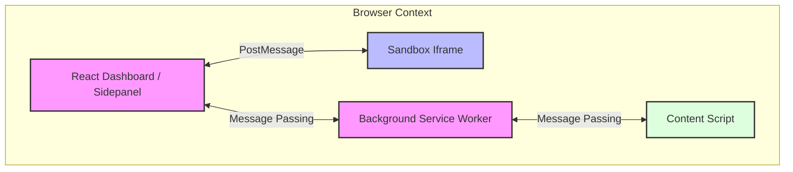

# ⚡ FlowScript

FlowScript is a premium, developer-focused browser extension for web automation. It features a sidepanel Monaco code editor, real-time log terminal, and an isolated sandbox engine that executes user-written automation scripts. By leveraging Manifest V3-compliant architecture and Chrome DevTools Protocol (CDP) helpers, FlowScript bypasses page-level event overrides, frames, and CAPTCHAs.

---

## 🏗️ Architectural Overview (Manifest V3 Compliance)

To comply with strict Manifest V3 security guidelines (which disallow arbitrary code execution like `eval()` and `new Function()` in privileged contexts), FlowScript divides operations into four distinct layers:



1. **React Dashboard / Sidepanel (Privileged Extension UI)**
   - Houses the Monaco Editor, run/pause controls, helpers, and the terminal logs view.
   - Runs with full extension context and permission.
2. **Sandbox Iframe (Isolated & Relaxed CSP)**
   - Resides at `chrome-extension://.../sandbox.html` with a relaxed Content Security Policy.
   - Allowed to safely perform `eval()` and execute user-defined scripts.
   - Exposes asynchronous API actions (`click`, `type`, etc.) and routes execution requests back to the sidepanel.
3. **Background Service Worker (Privileged Extension Context)**
   - Acts as the central system router. Coordinates messaging between the Sandbox / Sidepanel and the active webpage's Content Script.
   - Manages global state, extension lifecycles, and Chrome runtime tasks.
4. **Content Script (Target Webpage Context)**
   - The execution target in the web page DOM.
   - Performs actual low-level DOM manipulations (e.g. click, hover, element typing) and highlights running elements with micro-animations.

---

## 🛠️ Folder Structure & Workspace Layout

FlowScript is organized as a scalable **pnpm monorepo** managed with **Turbo**:

```text
flowscript-code/
├── apps/
│   └── extension/             # WXT browser extension app (React, Vite, Tailwind CSS v4, Monaco)
├── packages/
│   ├── shared/                # Shared utilities, constants, types, and action validator schemas
│   └── tsconfig/              # Shared base TypeScript configurations
├── turbo.json                 # Turbo workspace task pipeline
├── package.json               # Root monorepo dependencies and global scripts
└── pnpm-workspace.yaml        # Workspace projects definition
```

---

## 📚 Scripting API Reference

The Monaco Editor exposes several asynchronous APIs bound dynamically to the sandbox's execution context. You can use these to write your custom automation flows:

### Standard Actions
* **`click(selector)`**: Dispatches a standard DOM click event on the matched element.
  ```javascript
  await click('.submit-button');
  ```
* **`type(selector, text)`**: Simulates user typing into an input field or text area.
  ```javascript
  await type('#username', 'user123');
  ```
* **`scroll(selector)`**: Scrolls the matching element smoothly into the center of the viewport.
  ```javascript
  await scroll('#footer-terms');
  ```
* **`hover(selector)`**: Dispatches `mouseenter` and `mouseover` mouse events to the target element.
  ```javascript
  await hover('.dropdown-menu');
  ```

### Native CDP Actions (Bypass CAPTCHAs & Overrides)
* **`nativeClick(selector)`**: Dispatches an actual hardware mouse click at the coordinates of the target element via browser debugging protocols.
  ```javascript
  await nativeClick('#heavy-captcha-btn');
  ```
* **`nativeType(selector, text)`**: Inputs hardware-level keystrokes directly to the target element, triggering raw browser input events.
  ```javascript
  await nativeType('input[type="password"]', 'securePassword123');
  ```

### Helpers
* **`sleep(ms)`**: Pauses execution flow for a given duration.
  ```javascript
  await sleep(1000); // Wait for 1 second
  ```

---

## ⚡ Keyboard Hotkey & Text Expander Triggers

FlowScript includes a built-in event routing system that triggers specific automation scripts in response to real-time user input on any webpage. You can register triggers by writing `@trigger` annotations directly above your JavaScript/TypeScript functions in the editor.

### 🔌 How Triggers Work

1. **Annotation Parsing**: When your script is saved, FlowScript dynamically parses all `@trigger` annotations.
2. **Global Monitoring**: The extension's Content Script hooks into keydown and input events across all open browser tabs to detect matching triggers.
3. **Execution**: Upon a match, a message is routed through the Background Service Worker to the Sidepanel, where the target function is compiled and executed in the Sandbox.

---

### ⌨️ 1. Hotkey Triggers

Execute functions instantly when key combinations are pressed on any web page.

* **Annotation Format**: `// @trigger('hotkey', 'combination')`
* **Supported Modifiers**: `ctrl`, `shift`, `alt`, `meta` (Win/Cmd)
* **Example**:
  ```javascript
  // @trigger('hotkey', 'ctrl+shift+k')
  async function fillLoginForm() {
    console.log('Hotkey Ctrl+Shift+K pressed!');
    await type('#username', 'test_user');
    await type('#password', 'secret123');
    await click('#submit');
  }
  ```

---

### 📝 2. Text Expander Triggers

Type a short prefix in any input field or textarea to auto-expand it and simultaneously run associated automation logic.

* **Annotation Format**: `// @trigger('expander', 'shortcut', 'expanded text')`
* **Example**:
  ```javascript
  // @trigger('expander', ';;tq', 'Thank you for your prompt response! Let me know if you need anything else.')
  async function logAutoResponse() {
    console.log('Text expanded and logged!');
  }
  ```

---

### 🛡️ Validation and Safety

FlowScript validates all active triggers in real-time. If there is a validation issue, a warning card is displayed at the top of the **Editor** and **Triggers** tabs:

| Conflict Type | Description |
| :--- | :--- |
| **Hotkey Collision** | The same hotkey combination is assigned to more than one function. |
| **Expander Collision** | The same expander shortcut is assigned to more than one function. |

> [!NOTE]
> Trigger annotations are automatically stripped from the script before execution (via `cleanScriptCode`) so that they don't throw syntax or execution errors in the Sandbox.

---

## 🚀 Getting Started

### Prerequisites

- [Node.js](https://nodejs.org/) (v20+)
- [pnpm](https://pnpm.io/) (v9+)

### Installation

Clone the repository and install all workspace dependencies:

```bash
pnpm install
```

### Development Scripts

From the repository root, you can run:

* **Start Development (WXT + Live Reload)**
  ```bash
  pnpm dev
  ```
* **Build Project**
  ```bash
  pnpm build
  ```
* **Run Unit Tests (Vitest)**
  ```bash
  pnpm test
  ```
* **Type-check TypeScript**
  ```bash
  pnpm compile
  ```
* **Clean Build Directories**
  ```bash
  pnpm clean
  ```

---

## 🧪 Testing

We use [Vitest](https://vitest.dev/) for unit and integration testing. Tests are colocated within their respective packages.

To run tests:
```bash
pnpm test
```
