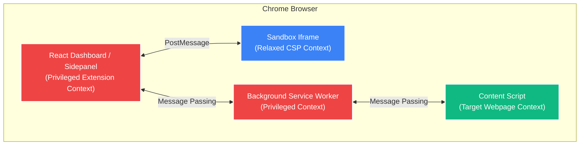

To comply with strict Manifest V3 security restrictions (which block arbitrary code execution like `eval()` and `new Function()` in privileged extension contexts), FlowScript splits responsibilities into four distinct execution environments:

---

## The Four Contexts

### 1. React Dashboard (Privileged Extension UI Context)
* **Scope**: Access to full Chrome extension APIs (tabs, storage, runtime).
* **Role**: The main interface. Houses the Monaco Editor, run/pause controls, active trigger statuses, and the terminal log viewer.

### 2. Sandbox Iframe (Relaxed CSP Context)
* **Scope**: No access to Chrome extension APIs or target webpage DOM. Resides inside a secure iframe (`chrome-extension://.../sandbox/index.html`) with a relaxed CSP.
* **Role**: The JavaScript engine. Compiles, runs, and monitors user-defined automation scripts using `eval()`. Standard APIs like `click` or `type` are mocked inside the sandbox and send postMessages to the React dashboard when called.

### 3. Background Service Worker (Privileged Extension Context)
* **Scope**: Access to standard background extension APIs.
* **Role**: The central router. Coordinates message-passing between the isolated Sandbox Iframe / React Dashboard and the target web page's Content Script. It also handles global trigger setups.

### 4. Content Script (Target Webpage Context)
* **Scope**: Access to the webpage DOM, isolated JavaScript environment.
* **Role**: The execution engine. Directly interacts with target page elements (highlighting them, performing standard DOM clicks, sending keyboard characters) and intercepts clicks during elements inspection.

---

## Execution Message Flow

When you write `await click('#submit-btn')` in the Monaco Editor and hit "Run":
1. The Sandbox Iframe evaluates the code.
2. The mocked `click()` function in the sandbox posts a message `action: "click", selector: "#submit-btn"` to the React Sidepanel.
3. The React Sidepanel routes this to the Background Service Worker via `chrome.runtime.sendMessage`.
4. The Background Service Worker forwards the click command to the active tab's Content Script.
5. The Content Script waits for the element, highlights it with a micro-animation, and dispatches a DOM click.
